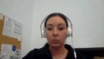
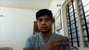
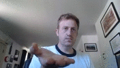
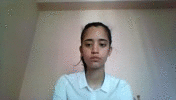
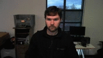
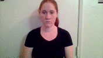
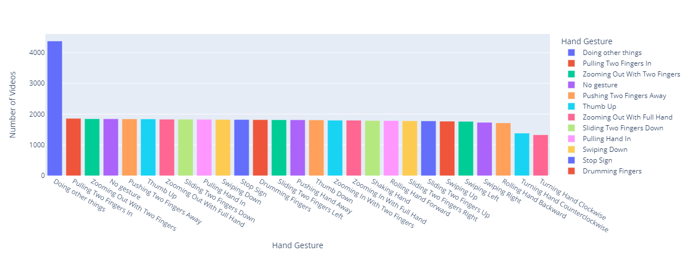
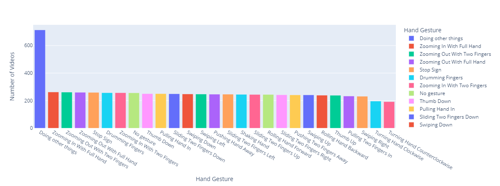

<div align="center">
  <h2 align="center">Hand Gesture Recognition</h2>
  <p align="center">
    
    
    
    <br>
    Building a hand gesture recognition model and using it to identify hand gestures in real-time to trigger actions on a computer
  </p>
</div>

<details open="open">
  <summary><h3 style="display: inline-block">Table of Contents</h3></summary>
  <ol>
    <li>
      <a href="#about-the-project">About the Project</a>
      <ul>
        <li>
          <a href="#built-with">Built with</a>
        </li>
        <li>
          <a href="#dataset">Dataset</a>
        </li>
        <li>
          <a href="#example-usage">Example Usage</a>
        </li>
        <li>
          <a href="#project-outline">Project Outline</a>
        </li>
      </ul>
    </li>
    <li>
      <a href="#prerequisites">Prerequisites</a>
    </li>
    <li>
      <a href="#setup">Setup</a>
    </li>
    <li>
      <a href="#acknowledgments">Acknowledgments</a>
    </li>
  </ol>
</details>

## About the Project

The COVID-19 pandemic has inevitably accelerated the adoption of a number of contactless Human-Computer Interaction (HCI) technologies, one of which is the hand gesture control technology. Hand gesture-controlled applications are widely used across various industries, including healthcare, food services, entertainment, smartphones, and automotive.

In this project, a hand gesture recognition model is trained to recognize static and dynamic hand gestures. The model is used to predict hand gestures in real-time through the webcam. Depending on the hand gestures predicted, the corresponding keystrokes (keyboard shortcuts) will be sent to trigger actions on a computer.

### Built with

* [Keras](https://keras.io/)
* [OpenCV](https://opencv.org/)
* [Plotly](https://plotly.com/)
* [pynput](https://pynput.readthedocs.io/en/latest/)
* [keras-hypetune](https://github.com/cerlymarco/keras-hypetune)

### Dataset

The dataset used is a subset of the LeapGestRecog dataset from [Kaggle](https://www.kaggle.com/datasets/gti-upm/leapgestrecog). It is a large collection of labeled images of humans performing hand gestures in front of a camera. In this project, 10 classes of hand gestures have been selected to train the hand gesture recognition model.

### Example Usage

Any actions on a computer can be triggered as long as they are linked to a keyboard shortcut. For simplicity, this project is configured to trigger actions on YouTube because it has its own built-in keyboard shortcuts.

The table below shows the hand gestures and the actions they trigger on YouTube.

<div>
  <table>
    <tr>
      <th>Hand gesture</th>
      <th>Action</th>
    </tr>
    <tr>
      <td>Swiping Left<br></td>
      <td>Fast forward 10 seconds</td>
    </tr>
    <tr>
      <td>Swiping Right<br></td>
      <td>Rewind 10 seconds</td>
    </tr>
    <tr>
      <td>Swiping Down<br></td>
      <td>Previous video</td>
    </tr>
    <tr>
      <td>Swiping Up<br></td>
      <td>Next video</td>
    </tr>
    <tr>
      <td>Sliding Two Fingers Down<br></td>
      <td>Decrease volume</td>
    </tr>
    <tr>
      <td>Sliding Two Fingers Up<br></td>
      <td>Increase volume</td>
    </tr>
    <tr>
      <td>Thumb Down<br></td>
      <td>Mute / unmute</td>
    </tr>
    <tr>
      <td>Thumb Up<br></td>
      <td>Enter / exit full screen</td>
    </tr>
    <tr>
      <td>Stop Sign<br></td>
      <td>Play / Pause</td>
    </tr>
    <tr>
      <td>No Gesture<br></td>
      <td>No action</td>
    </tr>
  </table>
</div>

## Project Outline

1. **[Data Exploration](DataExploration&Extraction.ipynb)**
   * Explore class distribution of training and validation data.
     - Training data:<br>
     - Validation data:<br>
2. **[Data Extraction](DataExploration&Extraction.ipynb)**
   * Extract training and validation data of the selected classes from the dataset.
3. **[Hyperparameter Tuning](HyperparameterTuning.ipynb)**
   * Perform grid search to determine the optimal values for dropout and learning rate.
4. **[Model Training](Training.ipynb)**
   * Build a 3D ResNet-101 model with the optimal hyperparameters.
   * Compile the model.
   * Train the model.
5. **[Classification](Classification.ipynb)**
   * Read frames from the webcam, predict the hand gestures in the frames using the model, and send the corresponding keystrokes to trigger actions on the computer.

## Prerequisites

* Python 3.7.9 or above

## Setup

```sh
pip install -r requirements.txt
